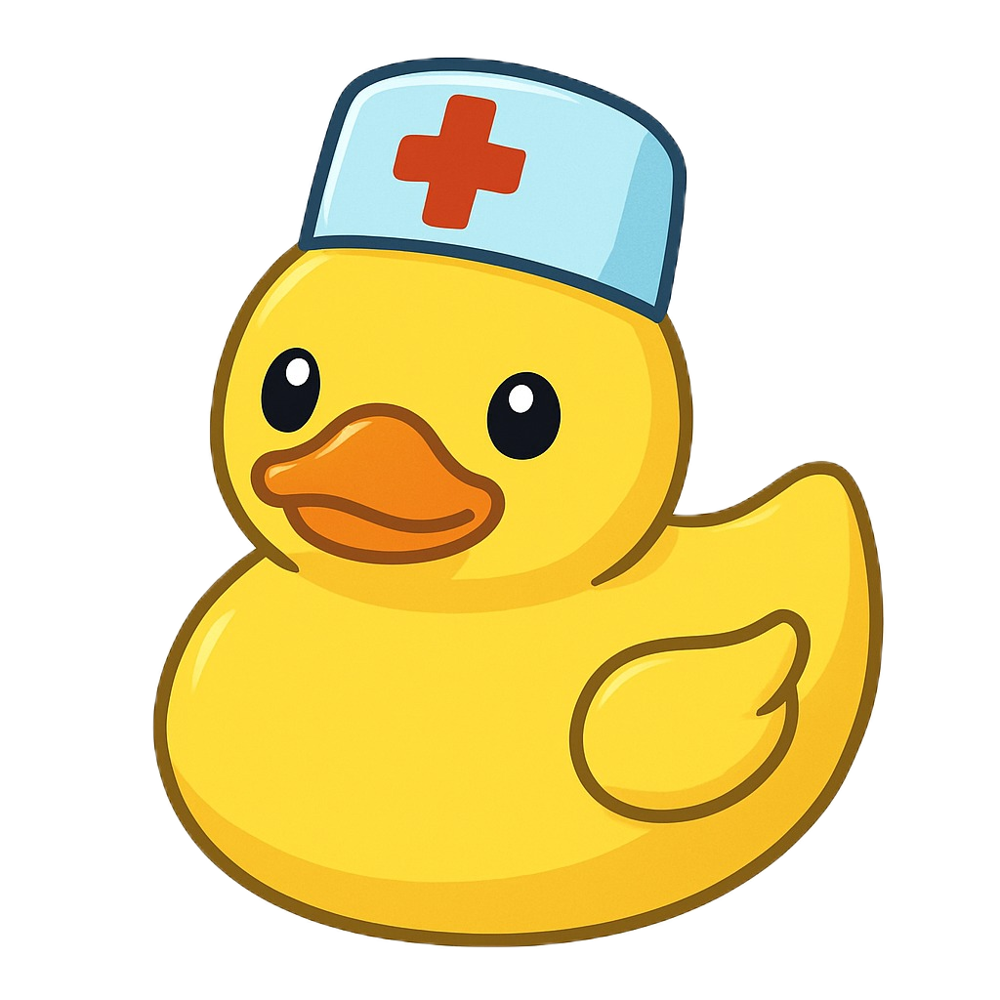

# Ducktors <image src="Ducktor.png" width="40" valign="middle">
> _A hospital terminal program for CS50 Python Final Project_
<!--  -->


---
### Functionalities 💡

patients can schedule appointments, view their receipts and reports.  
Doctors can write reports, view their patients' receipts and reports.

---
### Team 👥

⬥ [@Karim Ghazy](https://github.com/Karimskee) 😼  
⬥ [@Basmala Mohammed](https://github.com/basmalaaaaaaa) 🍀

---
### Associations 🔗

⬥ **Course provider:** [Harvard University](https://cs50.harvard.edu/python/)  
⬥ **Tutors:**  
&nbsp;&nbsp;&nbsp;&nbsp;⬥ [@David J. Malin](https://github.com/dmalan)❤️  
&nbsp;&nbsp;&nbsp;&nbsp;⬥ [@Carter Zenke](https://github.com/CarterZenke)❤️

---
### Frameworks 🧰

⬥ **Live Share:** For session sharing and easier team collaboration  
⬥ **colorama:** For terminal coloring  
⬥ **email_validator:** For email format validation  
⬥ **pyfiglet:** For python str to ASCII Art conversion

---
### Detailed Description 📝

##### Structure
```
Ducktors/
├── .vscode/
│   └── project_snippets.code-snippets
├── datasets/
│   ├── doctors_info.csv
│   ├── finished_reports.csv
│   ├── receipts.csv
│   ├── schedules.csv
│   ├── unfinished_reports.csv
│   └── users_login.csv
├── .gitattributes
├── Ducktor.png
├── plans.txt
├── project.py
├── README.md
├── requirements.txt
└── test_project.py
```

##### Files
⬥ **project_snippets.code-snippets:** Frequently used code blocks  
⬥ **doctors_info.csv:** Stores doctors' relevant information.  
⬥ **finished_reports.csv:** Stores all reports with doctor notes.  
⬥ **receipts.csv:** Stores all created patient receipts.  
⬥ **schedules.csv:** Stores all schedules details.  
⬥ **unfinished_reports.csv:** Stores all reports without doctor notes.  
⬥ **users_login.csv:** Stores users login information  
⬥ **Ducktor.png:** Project icon.  
⬥ **.gitattributes:** Necessary for git.  
⬥ **plans.txt:** Any future plans, known issues, individual tasks go here.  
⬥ **project.py:** The main python codes and functions  
⬥ **test_project.py:** Project unit testing  
⬥ **README.md:** The GitHub README file  
⬥ **requirements.txt:** pip installable libraries  
⬥ **test_project.py:** Test units for project.py

##### Classes
⬥ **Session:** Stores user login information, used for auth system  
⬥ **Commands:** Stores program commands, whether patient specific or doctor specific commands with methods for printing and running commands

##### Program Functions

###### Input & Validation
⬥ **is_email:** Checks if an email is valid  
⬥ **is_strong_password:** Checks if a password is strong enough  
⬥ **is_match:** Checks if the password matches the confirmation password  
⬥ **is_valid_name:** Checks if a name is in the required format  
⬥ **is_command:** Checks if a string is a program command, execute valid commands  
⬥ **get_name:** Prompt user for name and validate it  
⬥ **get_email:** Prompt user for email and validate it  
⬥ **get_input:** Prompt user for input, while checking for program commands

###### Pages
⬥ **login_page:** Logs user in (doctor or patient)  
⬥ **register_page:** Registers user (only patients)  
⬥ **patients_page:** Displays patients home page  
⬥ **schedule_page:** Appointment scheduling process  
⬥ **receipts_page:** Displays all patient receipts  
⬥ **reports_page:** Displays all patient reports with doctor notes  
⬥ **doctors_page:** Displays doctors home page  
⬥ **unfinished_reports_page:** Displays all reports without doctor notes  
⬥ **finished_reports_page:** Displays all reports with doctor notes

###### Others
⬥ **main:** The main function that runs the program  
⬥ **clear_terminal:** Clears terminal for clean UI  
⬥ **ducktors:** Prints Ducktors Hospital in ASCII Art  
⬥ **space:** Prints n blank lines  
⬥ **border:** Prints a bordered string  
⬥ **login_required:** Checks if user is logged in  
⬥ **patient_specific:** Checks if user is a patient  
⬥ **doctor_specific:** Checks if user is a doctor  
⬥ **logout:** Logs user out  
⬥ **exit_program:** Exits the program

---
### A word of appreciation 🌹

Words can not express the gratitude we both feel toward CS50, from the course content, learning path and structure, to the problem sets and the final project, it was simply incomparable with any learning experience we have ever had!  
Many thanks to the [@CS50](https://github.com/cs50) team and special thanks to Dr. [@David J. Malin](https://github.com/dmalan) for everything you've done to deliver the course in such an amazing way!


---
### Q&A 🤔
⬥ **How to register as a doctor?:** You can **not** directly register a doctor account, only manually via the database, as you would imagine in a real hospital.  
⬥ **What's with the schedules.csv?:** It is not accessible inside the program but rather through the file itself, neither doctors nor patients are meant to access that file but rather you, developer!  
⬥ **Quack?:** Quack Quack Quack Quack

---
### Demo video 🎥
⬥ **Link:** https://youtu.be/2yLKV0FVaks  
⬥ **Preview:**
[](https://youtu.be/2yLKV0FVaks)
